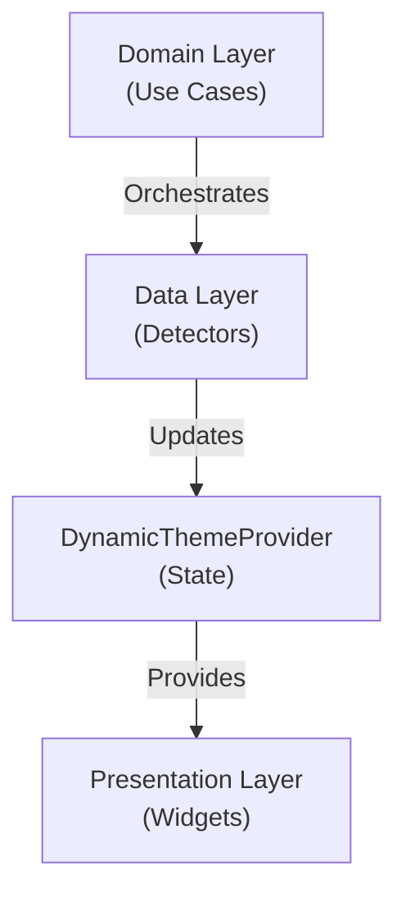

# 👨‍💻 Development Guide

Bienvenue dans le guide de développement pour **Unique Theme Launcher**. Ce document couvre tout ce que vous devez savoir pour travailler sur ce projet.

---

## 📋 Table des Matières

1. [Prerequisites](#prerequisites)
2. [Development Setup](#development-setup)
3. [Project Structure](#project-structure)
4. [Development Workflow](#development-workflow)
5. [Debugging](#debugging)
6. [Performance Tips](#performance-tips)
7. [Architecture Decisions](#architecture-decisions)

---

## ✅ Prerequisites

### Required Tools

```bash
# Check versions
flutter --version      # 3.0.0+
dart --version        # 3.0.0+
java -version         # 11+
git --version         # 2.0+
```

### Recommended IDE Extensions

**VS Code:**
```json
{
  "extensions": [
    "Dart-Code.dart-code",
    "Dart-Code.flutter",
    "fcalandra.pubspec-assist",
    "Google.android-ndk-manager"
  ]
}
```

**Android Studio:**
- Install Flutter Plugin
- Install Dart Plugin
- Enable Dart analysis

---

## 🛠️ Development Setup

### 1. Clone & Setup

```bash
git clone https://github.com/smartsniper31/unique-theme-launcher.git
cd unique-theme-launcher

# Link upstream
git remote add upstream https://github.com/smartsniper31/unique-theme-launcher.git

# Verify remotes
git remote -v
```

### 2. Install Dependencies

```bash
flutter pub get
flutter pub run build_runner build
```

### 3. Run on Device/Emulator

```bash
# List available devices
flutter devices

# Run on specific device
flutter run -d <device_id>

# Run in release mode
flutter run --release

# Run with profiling
flutter run --profile
```

### 4. Verify Setup

```bash
flutter doctor -v
dart analyze
dart format .
flutter test
```

Everything should be ✓.

---

## 🗂️ Project Structure

### Clear Separation of Concerns

```
lib/
├── core/                    # Infrastructure layer
│   ├── constants/          # App-wide constants
│   └── utils/              # Utilities & helpers
│
├── data/                    # Data access layer
│   ├── models/             # Serializable models
│   ├── sources/            # Data sources (detectors)
│   └── storage/            # Local persistence
│
├── domain/                  # Business logic layer
│   ├── entities/           # Core domain models
│   └── usecases/           # Business use cases
│
├── presentation/            # UI layer
│   ├── providers/          # State management
│   ├── screens/            # Full screens
│   └── widgets/            # Reusable widgets
│
└── main.dart               # Entry point
```

### Why This Structure?

- **Testability**: Each layer can be tested in isolation
- **Reusability**: Data/domain layers work without UI
- **Maintainability**: Clear dependencies and responsibilities
- **Scalability**: Easy to add new features

---

## 🔄 Development Workflow

### Before Starting

```bash
# Update to latest code
git pull upstream main

# Create feature branch
git checkout -b feature/your-feature-name
```

### During Development

**1. Write Code**
```bash
# Keep terminal window open for hot reload
flutter run
```

**2. Format & Lint (frequently)**
```bash
dart format .
dart analyze
```

**3. Test Manually**
```bash
# Navigate app, test feature
# Monitor logs: flutter run -v
```

### Before Committing

```bash
# 1. Format code
dart format .

# 2. Lint analysis
dart analyze --fatal-infos

# 3. Run tests
flutter test

# 4. Check no breaking changes
git diff lib/

# 5. Stage changes
git add .

# 6. Commit (use conventional format)
git commit -m "feat: add feature description"

# 7. Push to your fork
git push origin feature/your-feature-name
```

### After Committing

Open a Pull Request with detailed description.

---

## 🐛 Debugging

### Print Debugging

```dart
// Use debugPrint (respects debug output limits)
debugPrint('Status: $status');

// In release build, use log
import 'dart:developer' as developer;
developer.log('Important event');
```

### Logger Package (Recommended)

```bash
flutter pub add logger:^2.1.0
```

```dart
import 'package:logger/logger.dart';

final logger = Logger(
  printer: PrettyPrinter(),
);

logger.d('Debug message');
logger.i('Info message');
logger.w('Warning message');
logger.e('Error message');
```

### Android Logs

```bash
# View all logs
adb logcat

# Filter by tag
adb logcat | grep "unique_theme"

# Filter by log level
adb logcat *:W  # Warnings and errors
```

### Flutter DevTools

```bash
flutter pub global activate devtools
devtools

# Or use from IDE
# VS Code: Run > Open DevTools
```

### Common Issues

**Hot Reload not working:**
```bash
flutter clean
flutter pub get
flutter run
```

**Build cache issues:**
```bash
flutter clean
rm -rf .dart_tool/
rm pubspec.lock
flutter pub get
```

**Android build failing:**
```bash
rm -rf android/.gradle
flutter clean
flutter build apk --debug
```

---

## ⚡ Performance Tips

### Widget Building

```dart
// ❌ Bad: Rebuilds on every parent rebuild
@override
Widget build(BuildContext context) {
  return GestureDetector(
    onTap: () => print('Tapped'),
    child: Text('Expensive widget'),
  );
}

// ✅ Good: Extract to separate widget
class TappableText extends StatelessWidget {
  @override
  Widget build(BuildContext context) {
    return GestureDetector(
      onTap: () => print('Tapped'),
      child: Text('Expensive widget'),
    );
  }
}
```

### Provider Performance

```dart
// ✅ Good: Selector for partial state
Widget build(BuildContext context) {
  final name = context.select<DynamicThemeProvider, String>(
    (provider) => provider.userProfile.detectedName,
  );
  return Text(name);
}

// ❌ Bad: Rebuilds on any provider change
final provider = context.watch<DynamicThemeProvider>();
```

### Image Optimization

```dart
// Precache images at startup
precacheImage(AssetImage('assets/image.png'), context);
```

### List Performance

```dart
// ✅ Use ListView.builder for large lists
ListView.builder(
  itemCount: items.length,
  itemBuilder: (context, index) => ItemTile(items[index]),
)
```

---

## 🏗️ Architecture Decisions

### Why Provider?

- **Single-responsibility**: One provider = one piece of state
- **Testable**: Providers are just classes
- **Readable**: Clear data flow
- **Performance**: Built-in optimization with Selector

### Why Clean Architecture?

- **Testable**: Each layer can be tested independently
- **Maintainable**: Clear separation of concerns
- **Flexible**: Easy to swap implementations
- **Scalable**: Handles app growth without refactoring

### State Management Strategy



### Error Handling

```dart
// Use try-catch with meaningful messages
try {
  final profile = await _detectProfile();
  return profile ?? UserProfile.fallback();
} catch (e) {
  debugPrint('Error detecting profile: $e');
  return UserProfile.fallback();
}
```

---

## 📱 Testing

### Unit Tests

```bash
flutter test test/unit_tests.dart
```

```dart
// test/unit_tests.dart
void main() {
  test('ColorUtils generates consistent colors', () {
    final color1 = ColorUtils.generateColorFromName('Test');
    final color2 = ColorUtils.generateColorFromName('Test');
    
    expect(color1, equals(color2));
  });
}
```

### Widget Tests

```dart
testWidgets('BatteryIndicator shows correct value', 
(WidgetTester tester) async {
  await tester.pumpWidget(
    MaterialApp(
      home: BatteryIndicator(batteryLevel: 85),
    ),
  );
  
  expect(find.text('85%'), findsOneWidget);
});
```

### Coverage

```bash
flutter test --coverage
genhtml coverage/lcov.info -o coverage/html
```

---

## 🚀 Release Checklist

Before releasing a new version:

- [ ] All tests pass (`flutter test`)
- [ ] Code formatted (`dart format .`)
- [ ] No warnings (`dart analyze --fatal-infos`)
- [ ] Updated CHANGELOG.md
- [ ] Updated version in pubspec.yaml
- [ ] All issues closed or linked to milestone
- [ ] Created release tag: `git tag v1.x.x`
- [ ] Build release APK: `flutter build apk --release`
- [ ] Tested on multiple devices
- [ ] Documentation updated

---

## 📚 Useful Links

- [Flutter Documentation](https://flutter.dev/docs)
- [Dart Language Tour](https://dart.dev/guides/language/language-tour)
- [Provider Package](https://pub.dev/packages/provider)
- [Clean Architecture](https://resocoder.com/flutter-clean-architecture)
- [Android Developers](https://developer.android.com)

---

## ❓ Need Help?

- 📖 [README](README.md)
- 🤝 [CONTRIBUTING](CONTRIBUTING.md)
- 💬 [GitHub Discussions](https://github.com/smartsniper31/unique-theme-launcher/discussions)
- 🐛 [GitHub Issues](https://github.com/smartsniper31/unique-theme-launcher/issues)

---

Happy coding! 🚀
