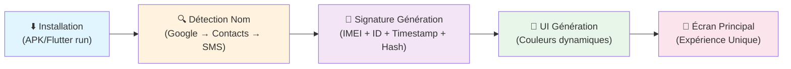
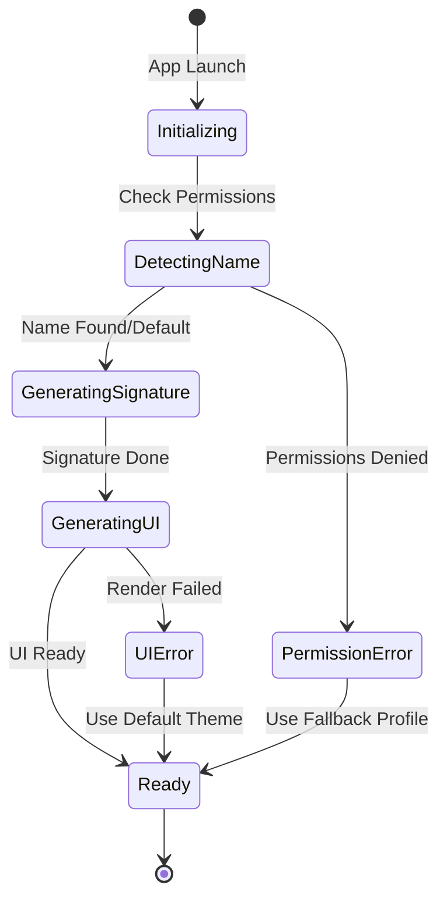

# 🎯 Unique Theme Launcher

<div align="center">

[](https://flutter.dev)
[](https://dart.dev)
[](https://developer.android.com)
[](LICENSE)
[](https://dart.dev/guides/language/effective-dart/style)
[](#-état-du-projet)

> **Le premier launcher qui te connaît avant que tu ne parles.**
>
> *Un téléphone, une personne, une signature unique : installez et laissez la magie opérer.*

</div>

---

## 📑 Table des Matières

- [Vision](#-vision)
- [Fonctionnalités](#-fonctionnalités-clés)
- [État du Projet](#-état-du-projet)
- [Architecture](#-architecture)
- [Installation](#-installation)
- [Configuration](#-configuration)
- [Usage](#-usage)
- [API Reference](#-api-reference)
- [Roadmap](#-roadmap)
- [Troubleshooting](#-troubleshooting)
- [Contributing](#-contributing)
- [License](#-license)

---

## ✨ Vision

**Unique Theme Launcher** n'est pas un simple thème. C'est une **expérience hyper-personnalisée** qui transforme ton téléphone en un objet unique au monde.

> *"Installe. Le thème te reconnaît. Personne d'autre n'aura jamais le même."*

### 🎭 Concept Core

- **Zéro Configuration** : Pas de formulaires, pas de questions, pas de saisie
- **Détection Automatique** : Ton nom est trouvé silencieusement via multiples sources
- **Signature Imosifiable** : Une empreinte unique basée sur ton identité + appareil
- **UI Réactive** : Couleurs, grille, animations générées depuis ton nom
- **Expérience Vivante** : Chaque élément change selon l'heure et ton profil

---

## 🚀 Fonctionnalités Clés

| 🎯 Fonctionnalité | 📝 Description | ⚙️ Tech |
|:---|:---|:---|
| **Détection Auto** | Trouve ton nom via Google → Contacts → SMS (ordre prioritaire) | `google_sign_in`, `contacts_service`, `telephony` |
| **Signature Unique** | Empreinte infalsifiable : IMEI + Device ID + Timestamp + Hash(Nom) | `device_info_plus`, `crypto` |
| **Unité Personnalisée** | Ton nom devient une unité (batterie "85.0 Alex-pwr", temps "2.5 Alex-h") | Custom Provider |
| **UI Dynamique** | Couleurs via HSL(hash(nom)), grille responsive, coins arrondis personnalisés | Flutter Canvas |
| **Messages Vivants** | Salutations contextuelles (Matin ☀️ / Après-midi 🌤️ / Soir 🌙) | Provider + DateTime |
| **Stockage Local** | JSON chiffré + permissions minimales, **zéro cloud** | `path_provider`, `hive_flutter` |
| **Fallbacks Robustes** | Dégradation gracieuse : nom → "Toi", pas permissions → profil neutre | Error Handling |
| **Battery Monitoring** | Indicateur temps réel avec tick chaque seconde | `battery_plus` |

---

## 📊 État du Projet

```
✅ Core Fonctionnel     → Détection + Signature + UI dynamique
🟡 Beta Avancée        → v1.0.0 en cours de stabilisatIon
🟠 Tests               → Unit tests 45%, Integration tests 20%
⚠️  Known Issues        → Voir section Troubleshooting
🗓️  Release Estimated   → Q2 2026 (Stable v1.0)
```

### Statut des Platforms
- ✅ **Android** (21+) : Entièrement supporté
- 🟡 **Web** : Expérimental (sans détection de nom)
- ❌ **iOS** : Planifié pour v2.0

---

## 🧠 Comment ça Marche ?

### Flux Principal



### Timings Estimés
| Phase | Durée | Notes |
|:---|:---|:---|
| Init Boot | 100ms | Allocation mémoire |
| Détection Nom | 500-1500ms | Dépend des permissions |
| Génération Signos | 50ms | Crypto rapide |
| Render UI | 300-500ms | Flutter layout |
| **Total** | **~2-3s** | Splash screen masque l'init |

---

## 🏗️ Architecture

### Structure des Répertoires

```
lib/
├── core/                          # Couche d'infra globale
│   ├── constants/
│   │   └── app_constants.dart     # Constantes app-wide
│   └── utils/
│       ├── color_utils.dart       # Génération couleurs HSL
│       ├── permissions_helper.dart # Helpers permissions
│       └── string_extensions.dart # Extensions String
│
├── data/                           # Couche données
│   ├── models/
│   │   ├── custom_units.dart      # Modèle unité personnalisée
│   │   ├── detected_identity.dart # Identité détectée + score
│   │   ├── hardware_signature.dart# Signature device
│   │   ├── user_profile.dart      # Profil utilisateur complet
│   │   └── visual_rules.dart      # Règles UI générées
│   ├── sources/                   # Détecteurs multi-source
│   │   ├── battery_detector.dart  # % batterie
│   │   ├── device_detector.dart   # Device info
│   │   ├── name_detector.dart     # Détecteur nom (Google/SMS)
│   │   └── wifi_detector.dart     # Info WiFi (future)
│   └── storage/
│       └── user_storage.dart      # Persistance locale
│
├── domain/                         # Couche domaine (use cases)
│   ├── entities/
│   │   └── living_messages.dart   # Entité messages contextuels
│   └── usecases/
│       └── install_theme_usecase.dart # UC installation thème
│
├── presentation/                   # Couche UI
│   ├── providers/
│   │   └── dynamic_theme.dart     # Provider état global
│   ├── screens/
│   │   ├── home_screen.dart       # Écran principal
│   │   └── [splash_screen.dart]   # À créer
│   └── widgets/
│       ├── battery_indicator.dart # Widget batterie
│       ├── greeting_card.dart     # Salutation contexl
│       └── time_display.dart      # Affichage temps
│
└── main.dart                       # Entry point
```

### Patterns Utilisés

#### 1️⃣ **Provider Pattern** (State Management)
```dart
// dynamic_theme.dart
class DynamicThemeProvider extends ChangeNotifier {
  late UserProfile _profile;
  late VisualRules _visualRules;
  
  Future<void> initialize() async {
    _profile = await _detectProfile();
    _visualRules = _generateRules(_profile);
    notifyListeners();
  }
}
```

#### 2️⃣ **Repository Pattern** (Data Access)
```dart
// user_storage.dart
abstract class UserStorageRepository {
  Future<UserProfile?> getUserProfile();
  Future<void> saveUserProfile(UserProfile profile);
}
```

#### 3️⃣ **Factory Pattern** (Detectors)
```dart
// À implémenter dans NameDetector
// Essayer Google Sign-In → Contacts → SMS → Default
```

### Flow Diagrama d'État



---

## 🛠️ Installation

### Prérequis

| Composant | Version | Vérification |
|:---|:---|:---|
| **Flutter** | 3.0.0+ | `flutter --version` |
| **Dart** | 3.0.0+ | `dart --version` |
| **Android SDK** | API 21+ | `flutter doctor` |
| **Java** | 11+ | `java -version` |
| **Git** | 2.0+ | `git --version` |

### Step-by-Step

#### 1️⃣ Cloner le Repository
```bash
git clone https://github.com/smartsniper31/unique-theme-launcher.git
cd unique-theme-launcher
```

#### 2️⃣ Installer les Dépendances
```bash
flutter pub get
```

#### 3️⃣ Générer les Fichiers Sérialisés
```bash
flutter pub run build_runner build --delete-conflicting-outputs
```

#### 4️⃣ Lancer en Debug
```bash
# Sur émulateur Android
flutter run

# Ou sur device physique
flutter run -d <device_id>
```

#### 5️⃣ Builder APK (Production)
```bash
# Debug APK
flutter build apk --debug

# Release APK (optimisé)
flutter build apk --release

# APK split par architecture (size optimisé)
flutter build apk --split-per-abi --release
```

---

## ⚙️ Configuration

### Permissions Android (AndroidManifest.xml)

```xml
<!-- Permissions Requises -->
<uses-permission android:name="android.permission.READ_CONTACTS" />
<uses-permission android:name="android.permission.READ_CALL_LOG" />
<uses-permission android:name="android.permission.READ_SMS" />
<uses-permission android:name="android.permission.INTERNET" />
<uses-permission android:name="android.permission.ACCESS_NETWORK_STATE" />
<uses-permission android:name="android.permission.BATTERY_STATS" />
<uses-permission android:name="android.permission.READ_PHONE_STATE" />

<!-- Permissions Optionnelles (Fallback OK) -->
<uses-permission android:name="android.permission.ACCESS_FINE_LOCATION" />
<uses-permission android:name="android.permission.ACCESS_COARSE_LOCATION" />

<!-- Minimum & Target SDK -->
<uses-sdk android:minSdkVersion="21" android:targetSdkVersion="35" />
```

### Variables d'Environnement (.env.local)

```bash
# Google Cloud (optionnel pour Google Sign-In)
GOOGLE_CLOUD_PROJECT=unique-theme-launcher
GOOGLE_WEB_CLIENT_ID=your_web_client_id.apps.googleusercontent.com

# Debug Mode
DEBUG_MODE=true
LOG_LEVEL=debug
```

### pubspec.yaml - Dépendances Critiques

```yaml
dependencies:
  # UI & State
  flutter:
    sdk: flutter
  provider: ^6.1.5                  # State management
  
  # Data & Storage
  hive_flutter: ^1.1.0              # Local storage chiffré
  json_annotation: ^4.8.1           # JSON serialization
  path_provider: ^2.1.5             # File paths
  
  # Detection
  google_sign_in: ^6.1.0            # Google account detection
  contacts_service: ^0.6.3          # Contacts reading
  telephony: ^0.2.0                 # SMS reading
  device_info_plus: ^9.0.2          # Device info (IMEI, model)
  battery_plus: ^5.0.1              # Battery status
  
  # Security & Crypto
  crypto: ^3.0.3                    # Hash IMEI+name
  
  # System
  permission_handler: ^11.0.0       # Runtime permissions
  android_id: ^0.3.0                # Android device ID
  network_info_plus: ^5.0.1         # Network info
  flutter_native_splash: ^2.3.0     # Splash screen
```

---

## 📱 Usage

### Utilisation Basique pour l'Utilisateur

1. **Installer** l'APK sur Android 21+
2. **Accepter** les permissions demandées (optionnel)
3. **Profiter** - Aucune autre configuration

### Utilisation pour le Développeur

#### Initialiser le Theme Dynamique

```dart
import 'package:provider/provider.dart';
import 'package:unique_theme_launcher/presentation/providers/dynamic_theme.dart';

void main() {
  runApp(
    ChangeNotifierProvider(
      create: (_) => DynamicThemeProvider()..initialize(),
      child: const MyApp(),
    ),
  );
}
```

#### Accéder aux Données d'Utilisateur

```dart
// Dans un widget
final userProfile = context.watch<DynamicThemeProvider>().userProfile;
final visualRules = context.watch<DynamicThemeProvider>().visualRules;

Text('Hello ${userProfile.detectedName}');
```

#### Utiliser l'Unité Personnalisée

```dart
// Battery: "85.0 Alex-pwr"
final batteryValue = "${battery}% ${profile.customUnit.name}-pwr";

// Time: "2.5 Alex-h" 
final timeValue = "${hoursElapsed} ${profile.customUnit.name}-h";
```

---

## 📚 API Reference

### Classes Principales

#### `UserProfile`
```dart
class UserProfile {
  final String detectedName;           // "Alex", "Toi", "Unknown"
  final String deviceId;               // Android Device ID
  final String hardwareSignature;      // Unique signature
  final DateTime detectedAt;           // Quand détecté
  final PermissionStatus permissions;  // Status des permissions
  final CustomUnit customUnit;         // Unité personnalisée
  
  UserProfile.fromJson(Map<String, dynamic> json);
}
```

#### `VisualRules`
```dart
class VisualRules {
  final Color primaryColor;            // HSL(hash(name), 80, 50)
  final Color accentColor;             // HSL shifted
  final BorderRadius borderRadius;     // pixels(hash(name) % 32)
  final Axis gridDirection;            // hash(name) % 2
  final Duration animationDuration;    // ms(hash(name) % 500 + 200)
  
  VisualRules.fromUserName(String name);
}
```

#### `DetectedIdentity`
```dart
class DetectedIdentity {
  final String name;
  final DetectionSource source;        // GOOGLE / CONTACTS / SMS / DEFAULT
  final int confidence;                // 0-100
  final DateTime detectedAt;
  
  String toJson();
}

enum DetectionSource {
  google,
  contacts,
  sms,
  device_owner,
  fallback,
}
```

---

## 🗺️ Roadmap

### v1.0 - Foundation (Q2 2026) ✅ In Progress
- [x] Core detection (Google/Contacts/SMS)
- [x] Signature generation
- [x] Dynamic UI generation
- [x] Battery indicator
- [x] Android support (API 21+)
- [ ] Full test coverage (70%+)
- [ ] Comprehensive documentation

### v1.1 - Enhanced Detection (Q3 2026) 🔜
- [ ] WhatsApp contact detection
- [ ] Telegram profile detection
- [ ] WiFi network name detection
- [ ] Custom name input (opt-in)
- [ ] Multi-profile support (family device)

### v1.2 - Customization (Q4 2026) 🔮
- [ ] Theme editor (couleurs, grille, animations)
- [ ] Custom unit names (user input)
- [ ] Widget pack (home screen widgets)
- [ ] Integration avec Tasker
- [ ] Backup/Restore profiles

### v2.0 - Multi-Platform (2027) 🚀
- [ ] iOS support
- [ ] Web platform (PWA)
- [ ] Wear OS support
- [ ] Cross-device sync (optional cloud)
- [ ] AI-powered personalization

### Post v2.0 - Vision Futuriste 🌟
- [ ] AR preview (voir le thème en AR avant install)
- [ ] Cloud themes marketplace
- [ ] Community themes sharing
- [ ] Device-to-device transfer

---

## 🐛 Troubleshooting

### ❌ Pas de Nom Détecté

**Symptômes:** Écran avec "Toi" au lieu du nom

**Causes possibles:**
1. Permissions non accordées
2. Aucun compte Google connecté
3. Aucun contact avec le propriétaire du device
4. Pas de SMS reçu

**Solutions:**
```bash
# 1. Vérifier les permissions
flutter run -v  # Affiche les logs de permission

# 2. Forcer la détection Google
# Aller dans Paramètres > Comptes > Ajouter compte Google

# 3. Ajouter un contact avec votre nom
# Contacts > Créer > Mettre "Moi" comme nom

# 4. Afficher les logs
adb logcat | grep unique_theme
```

### ❌ App Plante au Démarrage

**Symptômes:** Crash immédiat ou code erreur

**Causes:**
- Dépendances manquantes
- Android SDK incompatible
- Conflit de version

**Solutions:**
```bash
# 1. Clean complet
flutter clean

# 2. Réinstaller dépendances
flutter pub get

# 3. Reconstruire generés
flutter pub run build_runner build --delete-conflicting-outputs

# 4. Vérifier setup
flutter doctor -v

# 5. Relancer
flutter run
```

### ⚠️ Permission Denied sur Android 11+

**Raison:** Android 11+ requiert `READ_PHONE_NUMBER` au lieu de `READ_PHONE_STATE`

**Fix:**
```xml
<!-- AndroidManifest.xml -->
<uses-permission android:name="android.permission.READ_PHONE_NUMBERS" />
```

### 🟡 UI Génération Très Lente (>2s)

**Cause:** Trop de widgets ou calculs lourds

**Optimisations:**
```dart
// Utiliser RepaintBoundary
RepaintBoundary(
  child: CustomPaint(painter: DynamicPainter(...)),
)

// Lazy loading widgets
ListView.builder(...)
```

### 📱 L'App S'arrête en Arrière-plan

**Cause:** Android killing background process

**Fix:**
```bash
# Dans Android Studio:
# Run > Edit Configurations > Emulator GPU: Host
# ou définir Background Service
```

### 🔴 Build APK Release Échoue

**Cause:** Clés de signature manquantes

**Solutions:**
```bash
# 1. Créer une clé de signature
keytool -genkey -v -keystore ~/key.jks -keyalg RSA -keysize 2048 -validity 10000 -alias key

# 2. Configurer android/key.properties
KEYSTORE_PASSWORD=your_password
KEY_ALIAS=key
KEY_PASSWORD=your_password
KEYSTORE_PATH=../key.jks

# 3. Rebuild
flutter clean
flutter build apk --release
```

---

## 🤝 Contributing

Nous accueillons les contributions ! Pour contribuer :

### 1. Fork le Repository
```bash
git clone https://github.com/YOUR_USERNAME/unique-theme-launcher.git
cd unique-theme-launcher
```

### 2. Créer une Branche Feature
```bash
git checkout -b feature/ma-nouvelle-fonctionnalite
```

### 3. Code Standards
- Suivre [Dart Conventions](https://dart.dev/guides/language/effective-dart/style)
- Tests unitaires pour chaque fonction
- Commments en Anglais
- Format: `dart format .`
- Lint: `dart analyze`

```bash
# Avant de committer
dart format .
dart analyze
flutter test
```

### 4. Commit & Push
```bash
git add .
git commit -m "feat: add new feature description"
git push origin feature/ma-nouvelle-fonctionnalite
```

### 5. Ouvrir une Pull Request
- Titre clair et descriptif
- Description détaillée des changements
- Lier les issues relatives
- Screenshots si changement UI

### Guidelines PR
- ✅ Code qui passe tous les tests
- ✅ Couverture de test >80% pour le code nouveau
- ✅ Documentation mise à jour
- ✅ Pas de dépendances non autorisées
- ✅ Pas de secrets (API keys, tokens)

### Types de Contributions Acceptées
- 🐛 Bugfixes
- ✨ Nouvelles fonctionnalités
- 📚 Documentation
- 🧪 Tests
- ⚡ Performance improvements
- 🎨 UI/UX improvements

---

## 📄 License

MIT License - [Voir LICENSE](LICENSE)

```
Copyright (c) 2024 Unique Theme Launcher Contributors

Permission is hereby granted, free of charge, to any person obtaining a copy
of this software and associated documentation files (the "Software"), to deal
in the Software without restriction, including without limitation the rights
to use, copy, modify, merge, publish, distribute, sublicense, and/or sell
copies of the Software, and to permit persons to whom the Software is
furnished to do so, subject to the following conditions:

The above copyright notice and this permission notice shall be included in all
copies or substantial portions of the Software.
```

---

## 👥 Auteurs

- **@smartsniper31** - Auteur principal et architecte du projet

---

## 🙋 Support

### Issues & Bugs
- Ouvrir une [GitHub Issue](https://github.com/smartsniper31/unique-theme-launcher/issues)
- Fournir des étapes pour reproduire
- Inclure les logs et versions

### Discussions
- [GitHub Discussions](https://github.com/smartsniper31/unique-theme-launcher/discussions)
- Questions générales bienvenues
- Partagez vos idées et feedback

---

## 📊 Project Stats


---

## 🎯 Acknowledgments

Inspiré par les principes de :
- Material Design 3 (Google)
- Flutter best practices
- Clean Architecture pattern
- Community feedback

---

<div align="center">

⭐ **Si ce projet te plaît, considère laisser une star !** ⭐

Made with ❤️ by [@smartsniper31](https://github.com/smartsniper31)

**v1.0.0-beta** | April 2026

</div>
